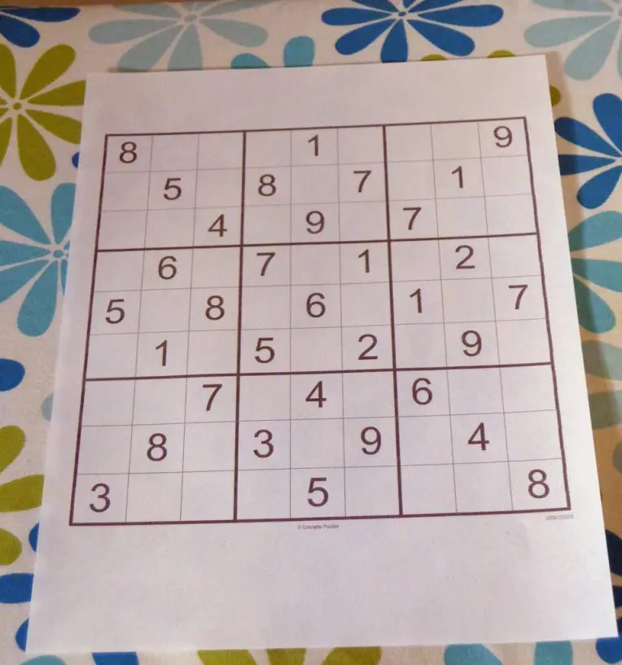

# Sudoku Puzzle Recognition

A computer vision model that recognizes sudoku puzzle based on images using OpenCV and PyTorch.

## Example

<div align='center'>
    
</div>

```python
from sudoku_recognition import SudokuRecognition

SudokuRecognition.recognize(image)
```

```
[[8, 0, 0, 0, 1, 0, 0, 0, 9],
 [0, 5, 0, 8, 0, 7, 0, 1, 0],
 [0, 0, 4, 0, 9, 0, 7, 0, 0],
 [0, 6, 0, 7, 0, 1, 0, 2, 0],
 [5, 0, 8, 0, 6, 0, 1, 0, 7],
 [0, 1, 0, 5, 0, 2, 0, 9, 0],
 [0, 0, 7, 0, 4, 0, 6, 0, 0],
 [0, 8, 0, 3, 0, 9, 0, 4, 0],
 [3, 0, 0, 0, 5, 0, 0, 0, 8]]
```

## Approach

A very high-level overview of the idea - we first extract each square on a sudoku puzzle using some image processing techniques and then for each square, we feed it to a neural network to classify the digit on the image.

A more detailed write-up of the approach can be found in the following notebooks:
- [Sudoku Puzzle Extractor](./Sudoku%20Puzzle%20Extractor.ipynb)
  - Notebook that goes through the way to extract the squares from the sudoku puzzle.
- [Handwritten Digit Recognition](Handwritten%20Digit%20Recognition.ipynb)
  - Notebook that goes through the model definition and training process.
- [Sudoku Puzzle Recognition](./Sudoku%20Puzzle%20Recognition.ipynb) 
  - Notebook that goes through the result of combining the two techniques.

## Failed Attempts

The notebook about the failed attempts here can be found in `/failed_attemps`.

**1st attempt**

My first attempt is to train a CNN that can recognize the puzzle based off the picture. This was my first idea and I was very skeptical about it. It turned out I was right (I hope I was wrong tho). It failed because the output is too complicated for the neural network to learn and the lack of dataset. There is a [sudoku_dataset](https://github.com/wichtounet/sudoku_dataset) but the data is still not enough. (or just skill issue)


**2nd attempt**

My second attempt is very similar to the approach I am using right now which is to first extract the square and then feed it to a neural network. Except, I am using another neural network to recognize the 4 corner of each squares. And you guess it, it failed again because the output is too complicated for the neural network to learn and the lack of dataset. (or just skill issue)

**3rd attempt**

My third attempt is about using a neural network to localize the sudoku puzzle. And for the same reason, it failed again! But, I managed to find a better way to do this that uses contours.